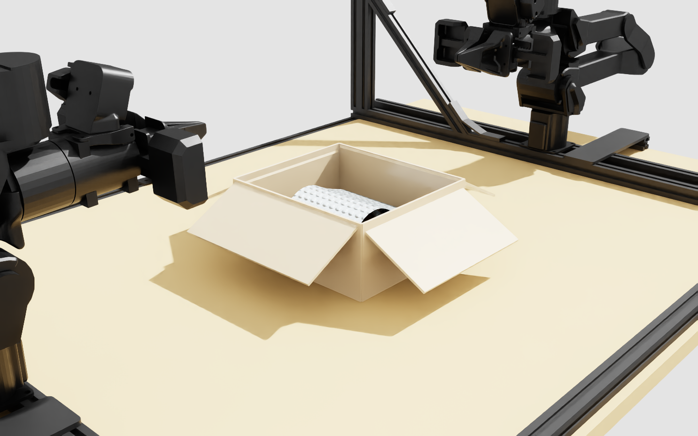

# sim-forge

Isaac Sim 物理模擬資產的生成管線。每個模擬是 `sims/` 底下一個獨立資料夾,
自帶參數表、生成腳本、驗收腳本與實測紀錄。

目前有兩個:

| 模擬 | 內容 |
| --- | --- |
| [`sims/wrapped_mug`](sims/wrapped_mug) | 逆物流情境:紙箱內用泡泡紙包覆的馬克杯,放進 stationary_ai 雙臂平台 |
| [`sims/fr3_bubblewrap_pack_20261007`](sims/fr3_bubblewrap_pack_20261007) | 同一情境的**物理模擬開發紀錄**(2026-09-30~10-07):surface / volume deformable 包材折疊、入箱、搬箱、開蓋、夾爪掀包材、FR3 可達性;含 122 次模擬紀錄、自動測試集與場景 USD |



## 設計原則

每個模擬遵守同一套規矩,方便互相參考、也方便換件:

1. **所有數字集中在 `params.py`**,每個值標註來源(`measured` / `literature` / `derived` / `assumed`)。
   寫死在程式裡的常數不算數。
2. **尺寸盡量推導,不手填**。換一顆杯子,紙箱與包材尺寸要自己重算。
3. **每個踩過的坑寫進註解**,而且寫「為什麼」,不只寫「怎麼做」。
   跨版本的 API 行為差異尤其要記,下一個人才不用重踩。
4. **驗收要可證偽**。`verify_render.py` 重開產出的 USD、無外力播放 N 步、量漂移,
   給出數字而不是「看起來還好」。
5. **產出物不進版控**。USD、算圖、log 都由腳本重建。

## 環境

Isaac Sim 5.1.0-rc.19(Kit 107.3 / PhysX 107.3.26),安裝在 `/isaac-sim`。
腳本一律用 `/isaac-sim/python.sh` 執行。

```bash
# 不啟動 Isaac runtime 也能用 pxr / PhysxSchema(讀 USD、算幾何)
source tools/usdenv.sh && $PY your_script.py
```

## 第三方資產

`sims/*/assets/` 不進版控。NVIDIA 官方資產用腳本取得:

```bash
tools/fetch_assets.sh
```
