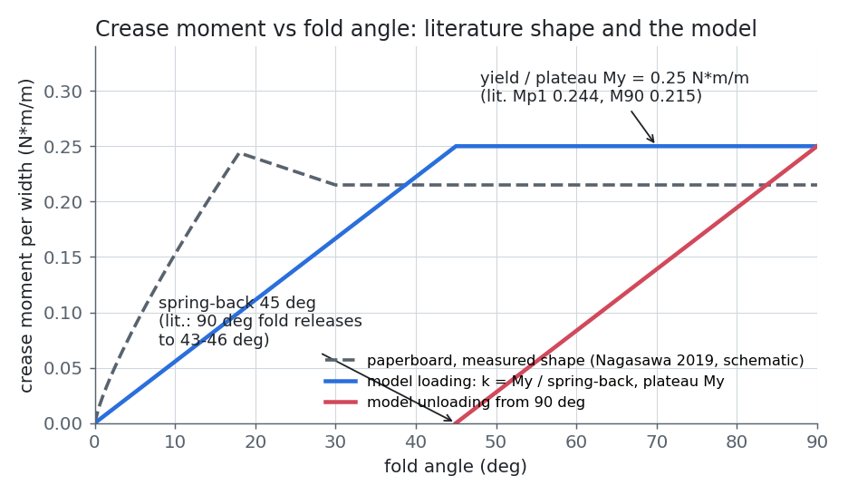
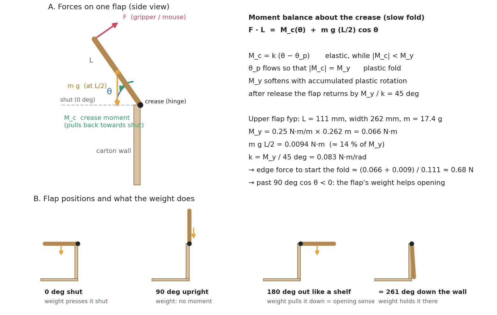
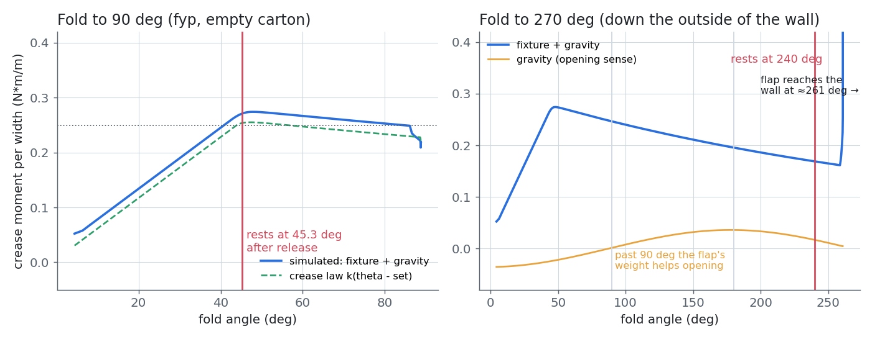
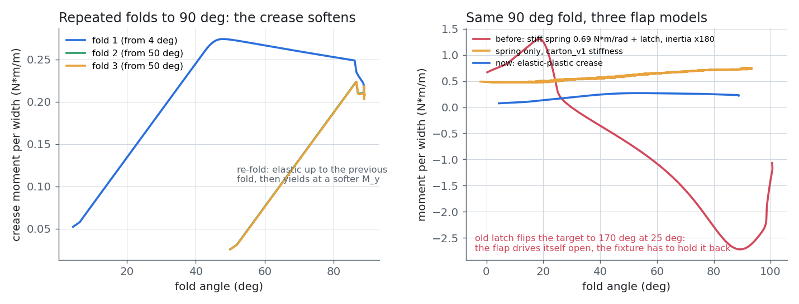

# 紙箱蓋摺痕的力學：文獻、模型與模擬驗證

> 對象：要接手或報告這個紙箱模擬的人。說明蓋子為什麼這樣動、參數從哪來、哪些是量過的、哪些是假設。
> 版本：2026-10-10，`portable-isaac-launch` 分支。數字都在 Isaac Sim 6.0（pip）上量的；交付用的 `scene_final_phys.usd` 尚未以新參數重建（見 §7）。

## 1. 結論先講

| 問題 | 原本 | 現在 |
|---|---|---|
| 有沒有「降伏」（摺過頭就留下永久折痕） | 預設**沒有**：`lid_latch.py` 只是開／關兩段式閂鎖（超過 25° 就把目標角切到 170°）。另有選用的 `crease_hold_ui.py` 有彈塑性，但降伏力矩 0.60 N·m（約蓋子自重力矩的 70 倍），滑鼠拉不過降伏點 | **有**，預設載入 `sim/crease_plastic.py`：彈性段 → 降伏 → 塑性平台 → 放手後部分回彈，重複摺疊會變軟 |
| 能開到幾度 | 約 100° 就卡住 | 可以一路摺到箱壁外側（約 261°，被箱壁擋住；理想 270°） |
| 為什麼卡在 90° 左右 | ①牆外的隱形防穿模墊片擋到蓋子；②關節是一般（maximal）關節，PhysX 只算 ±180°，超過會被限位甩回去 | ①墊片和蓋子逐對設成不碰撞；②整個紙箱改成 articulation（關節鏈），角度可以超過 180° |
| 「過了 90° 就變好拗」 | 部分是上面的卡住問題 | 真實現象：過了 90° 之後**蓋子自己的重量開始幫忙往外開**（§2.5） |

## 2. 文獻：真實紙箱摺痕怎麼受力

### 2.1 摺痕的結構

紙箱在出廠前會在摺線上**壓線（creasing / scoring）**：用壓線刀把紙板壓進一條溝，中間層被剪斷、**脫層（delamination）**。摺疊時，外側層被拉長，內側層被壓縮而**鼓起（bulging）**。Nagasawa 等人把摺痕的抵抗彎矩分成三個來源 [1]：

1. 外側層的拉伸阻力
2. 內側（鼓起）層的壓縮阻力
3. 中間層剝離（脫層）的阻力：只在摺疊初期出現

Beex & Peerlings 的實驗和模擬顯示，一條好的摺痕需要壓線時先產生適量脫層，以降低彎曲剛性、避免摺的時候表層破裂；壓得太淺會讓表層斷裂 [2]。

### 2.2 彎矩－角度曲線（最重要的一張圖）



0.3 mm 白紙板、摺到 90° 的量測（Nagasawa 2019 [1]）：

| 階段 | 角度 | 行為 | 數值（每公尺摺痕寬度） |
|---|---|---|---|
| 彈性 | 0 → 約 20° | 近似線性，沒有脫層、鼓起 | — |
| 峰值 | 約 20° 附近 | 脫層開始，最大彎矩 Mp1 | **Mp1 ≈ 0.244 N·m/m**（0.2 rps） |
| 平台 | 20° → 90° | 彎矩近乎定值，像 Maxwell 黏彈性的潛變 | 90° 時 **M90 ≈ 0.215 N·m/m** |
| 停住 | 停在 90° | 彎矩鬆弛（1 秒後掉到約 0.175 N·m/m），隨 ln(t) 下降 | — |
| 放手 | 卸載 | 立刻回彈到約 **46°**，之後隨 ln(t) 慢慢再回到約 43° | 回彈約 **44–46°** |

其他文獻補充：
- **淺壓痕可能有兩個峰值**：Mentrasti 等人量了 0–180° 的完整曲線，壓痕淺時彎矩會出現至多兩個峰值、接著不穩定下降；壓痕深時變成單調。卸載曲線一律是單調的，而且幾乎與壓痕條件無關 [3]。
- **重複摺疊會變軟**：反覆摺疊時，殘留角和剛性會隨摺疊次數改變（Nagasawa 等人的重複摺疊研究 [4]）。
- **速度相依**：摺得越快彎矩越大，但很弱：Mp1 = 0.013 ln(ω/0.2) + 0.244 N·m/m，ω 單位為 rps [1]。

### 2.3 瓦楞紙板

這個紙箱是瓦楞紙板（3 mm）。**我們沒有找到直接量測瓦楞紙板「每公尺摺痕彎矩」的公開數據**，只有：
- 整片瓦楞紙板的彎曲剛性標準（TAPPI T836、SCAN-P 65、四點彎曲；B 楞約數 N·m 等級）[5][6]
- 雙層瓦楞紙板壓線條件對摺痕彎矩影響的研究（數值未公開取得）[7]
- 你的 carton_v1 引用的 B 楞 130TL 彎曲剛性 4.26 / 1.84 N·m（MD / CD）[8]

所以這裡**用紙板的 0.25 N·m/m 當瓦楞摺痕的降伏彎矩**，並明確標為「未校準假設」。實際的瓦楞摺痕很可能更硬（板更厚），要校準請見 §7。

### 2.4 回彈（spring-back）

文獻中最穩定的量是「摺到 90° 再放手，會回到約 45°」[1]：第一次摺疊時，大約一半的角度是塑性（留下來），一半是彈性（彈回去）。真實紙箱也是這樣：新箱子的蓋子掀開到直立後放手，會自己彈回到半開。

### 2.5 重力：為什麼「過了 90° 就變好拗」



繞摺痕的力矩平衡（慢慢摺、忽略慣性）：

```
F · L  =  M_c(θ)  +  m g (L/2) cos θ
```

- **θ < 90°**：cos θ > 0，蓋子的重量把它往關的方向壓，要多施力。
- **θ > 90°**：cos θ < 0，重量變成往**開**的方向拉，需要的力突然變小。

上層蓋 fyp 的重量力矩 m g L/2 = 0.0094 N·m，約是降伏彎矩的 14%。所以「90° 之前比較吃力、過了 90° 變輕鬆」是真實的物理，不是 bug。原本那種「卡在 90–100° 硬推過去才好拗」才是 bug（§1）。

## 3. 模型

### 3.1 方程

每片蓋子是一個剛體，用一個旋轉摺痕接在箱子上。摺痕採用**彈性－塑性（加軟化、帶小黏性）**模型，和 parcel-forge `carton_v1` 的 `crease_model.advance` 相同：

```
彈性彎矩      M_c = k (θ − θ_p)                  θ_p = 塑性角（永久折痕）
目前降伏彎矩   M_y,now = M_y · max(0.5, exp(−s · κ))   κ = 累積塑性轉角（rad），s = 軟化率
塑性流動      若 |k(θ − θ_p)| > M_y,now：
              Δθ_p = sign · (|k(θ − θ_p)| − M_y,now) · Δt / (η + k Δt)      η = k · t_visc
```

- 用後退尤拉法（backward Euler）更新，彎矩不會跑到降伏面之外。
- 實作方式：USD 關節的 angular drive 就是彈性部分（剛性 k、目標角 = θ_p）。`crease_plastic.py` 每個物理步更新 θ_p，寫回 drive 的目標角。
- 角度是**連續展開**的（unwrapped），可以超過 180°。

### 3.2 參數

| 參數 | 值 | 來源 | 狀態 |
|---|---|---|---|
| 降伏／平台彎矩 M_y | **0.25 N·m/m** × 摺痕寬度（上層蓋 0.066 N·m、下層蓋 0.055 N·m） | Nagasawa 2019：Mp1 0.244、M90 0.215 N·m/m（紙板） | 文獻值（紙板），**瓦楞未校準** |
| 回彈角 M_y / k | **45°** | Nagasawa 2019：90° 放手回到 43–46° | 文獻值 |
| 彈性剛性 k | M_y / 45° = 0.318 N·m/rad/m（上層蓋 0.083 N·m/rad） | 由上兩項推出 | 推導 |
| 軟化率 s | 0.15 /rad，下限 0.5 M_y | carton_v1 | 假設 |
| 塑性黏性時間 t_visc | 0.02 s | carton_v1 | 數值穩定用 |
| 阻尼 | 臨界阻尼 × 0.5 | — | 數值穩定用 |
| 蓋子質量、慣量 | 由幾何和密度 200 kg/m³ 計算（上層蓋 17.4 g） | 幾何 | 原本寫死 0.006 kg·m²（約真實的 90 倍）加 armature 0.006，已移除 |
| armature | 2e-4 kg·m² | — | 數值穩定用 |
| 關節限位 | −275° … +5°（開為負） | 270° = 摺到箱壁外側 | — |

**已知的偏差**：單一剛性 k 的模型，彈性段會延伸到 45° 才降伏，文獻大約是 20°（文獻的卸載剛性比加載剛性軟）。我們選擇讓「回彈 45°」和「降伏彎矩」這兩個最容易觀察的量和文獻一致，代價是 20–45° 之間的彎矩略低於文獻曲線（見 §2.2 的圖）。

### 3.3 USD 和程式上的改動

| 檔案 | 改動 |
|---|---|
| `sim/build_phys_scene.py` | 紙箱改成 articulation（`ArticulationRootAPI` 在 `/World/Packed/Box`，自我碰撞開、迭代 32/8）；摺痕剛性、降伏彎矩寫進關節（`crease:yieldMoment`、`crease:width`）；限位 −275…+5；蓋子慣量改由幾何計算；防穿模墊片和蓋子之間逐對設定不碰撞（`FilteredPairsAPI`） |
| `sim/crease_plastic.py` | 新的摺痕控制器（每個物理步更新塑性角） |
| `sim/webrtc_boot.py`、`sim/ui_boot.py` | 預設載入 `crease_plastic.py`；`LID_MODE=latch` 用舊的閂鎖、`LID_MODE=spring` 只有彈簧 |
| `sim/crease_test.py` | 摺痕試驗（模仿文獻的摺疊試驗機）：夾住箱子、等角速度摺到指定角度、停住、放手，量曲線與回彈 |
| `sim/plot_crease.py` | 產生本文件的圖 |

## 4. 驗證結果

（數字由 `sim/crease_test.py`、`sim/verify_phys_scene.py`、`sim/lid_test.py` 量得，Isaac Sim 6.0。）

### 4.1 摺痕試驗（模仿文獻的摺疊試驗機）

`sim/crease_test.py`：箱子用固定關節夾住，PD 夾具以 60°/s 把上層蓋 fyp 摺到指定角度，停 1 秒，放手 3 秒後看停在幾度。圖中的「量到的摺痕彎矩」= 夾具力矩 + 重力力矩，除以摺痕寬度 0.262 m。



| 試驗 | 結果 | 文獻 / 預期 |
|---|---|---|
| 摺到 90° → 放手（空箱） | 停在 **45.3°**，回彈 **44.7°** | 90° 放手回到 43–46° [1] |
| 同上，箱內有包材和杯子 | 停在 45.3°，回彈 44.7° | 同上 |
| 降伏後平台彎矩 | 約 0.27 → 0.24 N·m/m，隨摺疊角度慢慢下降（軟化） | Mp1 0.244、M90 0.215 N·m/m [1] |
| 摺到 270°（往下摺到箱壁外側） | 蓋子轉到 **260.8°** 碰到箱壁停住；放手後停在 **240°** | 270° = 貼平；鉸鏈位置使它差約 9° 就碰壁 |
| 重複摺到 90°，三次 | 回彈 44.7° → 44.6° → 44.5°；第二次以後先彈性走到上次的位置，再以較軟的 M_y 降伏 | 重複摺疊會變軟 [4] |
| 對照：只有彈簧（carton_v1 剛性、無塑性） | 摺到 90° 放手後**完全彈回關閉**（−2.6°） | 沒有永久折痕 |
| 對照：交付版原本（硬彈簧＋閂鎖） | 25° 時閂鎖把目標角切到 170°，蓋子自己往外衝，最後卡在 **102.5°**（被牆外墊片擋住） | — |



### 4.2 實際操作的情境

| 測試 | 交付版原本 | 現在 |
|---|---|---|
| 手臂在蓋子邊緣往上拉（`verify_phys_scene.py --test P`，力在 4 s 內加到 3 N） | 1.53 N → 10°；3 N 只到 21°；放手彈回 1.5° | 0.29 N → 10°、0.64 N → 30°、1.43 N → 60°；3 N 時 76.5°；放手**停在 30.6°** |
| 滑鼠拉上層蓋（`lid_test.py`，pickingForce 70） | 67° 後閂鎖翻開，卡在約 100° | 拉到 80° / 76°，放手**停在 34° / 30°** |
| 滑鼠拉下層蓋 | 27°，放手掉回 0° | 7.6°：上層蓋只停在約 30°，仍壓在下層蓋上方。要先把上層蓋翻過 90°（放手後才會停在外面），跟真實紙箱一樣 |
| 靜置 8 s（test A） | 蓋子不動 | 上層蓋 2.6°（原本的微開）、下層蓋 6.9°（被包材頂起），不動 |
| 搬運：箱底 +100 mm x、+90 mm z（test B） | 傾斜 0.8° | 位移 99 / 87 mm、傾斜 1.0°；**上層蓋被頂開約 15° 並留在那裡** |
| 劇烈甩動 1.5 m/s（test S） | 穿出側牆的頂點最多 12 | 最多 10；**一片上層蓋被甩開到 73°，最後停在 26°** |
| 箱子質量 | 0.352 kg | 0.110 kg（箱底墊片的質量已移除） |

搬運和甩動時蓋子會被頂開或甩開：摺痕照文獻變軟之後，包材往上頂再加上加速度，就足以讓蓋子降伏。沒封箱的真實紙箱也會這樣；如果任務需要蓋子保持關閉，要在任務中封箱，或暫時改用 `LID_MODE=latch`。

## 5. 影片（示意）

影片依專案規定不進 git（`.gitignore` 排除 `*.mp4`），在本機 `videos/`，可以用下列指令重新產生：

| 影片 | 內容 | 產生方式 |
|---|---|---|
| `videos/crease_report.mp4`（22 s） | 下面三段接在一起，報告用 | `ffmpeg concat` |
| `videos/crease_fold90.mp4` | 摺到 90°、停住、放手，回彈到 45°（側視，畫面顯示角度、夾具力矩、摺痕彎矩、塑性角） | `crease_test.py ... --track 90 --empty --video ...` |
| `videos/crease_fold270.mp4` | 摺到箱壁外側（約 261°），放手停在 240° | `crease_test.py ... --track 270 --empty --video ...` |
| `videos/crease_fold90_packed.mp4` | 同 90°，箱內有包材和杯子 | `crease_test.py ... --track 90 --video ...` |
| `videos/pull_fyp_crease.mp4` | 手臂式往上拉蓋子邊緣（力在 4 s 內加到 3 N），放手停在約 31° | `verify_phys_scene.py ... --test P --video ...` |
| `videos/pull_fyp_before_after.mp4` | 上下對照：原本（3 N 只到 21°）vs 修正蓋子慣量後 | 2026-10-09 |

指令都在 `sim/` 下執行，場景是 `build_phys_scene.py` 的輸出；完整的一組在 `sim/run_crease_matrix.sh`（`SCENE=<場景>` 指定場景，預設 `scene_final_phys.usd`）。

## 6. 三個紙箱模型比較

| | 交付版原本 | parcel-forge carton_v1 | 現在 |
|---|---|---|---|
| 摺痕 | 硬彈簧 0.69 N·m/rad＋開關閂鎖；選用的彈塑性降伏 0.60 N·m | 黏塑性＋軟化（M_y 0.029 N·m/m、回彈 4°） | 黏塑性＋軟化，**文獻值**（M_y 0.25 N·m/m、回彈 45°） |
| 蓋子慣量 | 寫死，約真實的 180 倍（含 armature） | 由幾何計算 | 由幾何計算 |
| 可摺角度 | ±185°（實際約 100° 卡住） | −5…270°（articulation） | −275…+5°（articulation，到約 261° 貼壁） |
| 參數依據 | 為了數值穩定 | 「依手感目標推出」，標明未校準 | 文獻量測（紙板），標明瓦楞未校準 |
| 整合 | 包材、杯子、手臂、滑鼠、ROS 2 | 只有紙箱 | 同交付版 |

carton_v1 的回彈只有 4°，是「放到哪就停在哪」的手感設計；文獻顯示真實紙板摺到 90° 會彈回約一半，所以現在用 45°。

## 7. 限制和下一步

1. **瓦楞摺痕沒有校準**：0.25 N·m/m 是紙板的值。最直接的校準：拿實際的箱子，用推拉力計在蓋子邊緣量「開始摺動的力」F₀，則 M_y ≈ F₀ · L − m g L/2；再量「摺到 90° 放手後停在幾度」，得到回彈角。改 `build_phys_scene.py --crease_my_per_m` 和 `--crease_springback_deg` 即可。
2. **沒有模擬時間相依的行為**：停住時的彎矩鬆弛、放手後隨 ln(t) 的慢慢回彈 [1]。
3. **單一剛性**（§3.2 的偏差）。
4. **紙板不會凹、不會破**：面板是剛體，只有摺痕會變形。
5. **交付場景還沒重建**：這台只有 Isaac Sim 6.0，用 6.0 建置時杯子在沉降時會轉約 90°，跟原本 5.1 建的不同。在有 5.1 的機器上執行 `cd sim && python.sh build_phys_scene.py` 即可套用（新參數都是預設值）。

## 參考文獻

1. S. Nagasawa, S. Kaneko, D. Adachi, "Effects of rotational velocity and hold time at folding posture on time-dependent release behavior of creased white-coated paperboard," *J. Advanced Mechanical Design, Systems, and Manufacturing* 13(1), 2019. DOI [10.1299/jamdsm.2019jamdsm0004](https://doi.org/10.1299/jamdsm.2019jamdsm0004)（全文：[PITA Papermaking 5(2) 2019](https://www.pita.org.uk/images/Papermaking_Vol5_Nr2_2019_-_Article_7_-_Carton_Creasing.pdf)）
2. L.A.A. Beex, R.H.J. Peerlings, "An experimental and computational study of laminated paperboard creasing and folding," *Int. J. Solids and Structures* 46, 4192–4207, 2009. DOI [10.1016/j.ijsolstr.2009.08.012](https://doi.org/10.1016/j.ijsolstr.2009.08.012)（[全文](https://orbilu.uni.lu/handle/10993/17431)）
3. L. Mentrasti, F. Cannella, M. Pupilli, J.S. Dai, "Large bending behavior of creased paperboard. I. Experimental investigations," *Int. J. Solids and Structures* 50(20–21), 3089–3096, 2013. DOI [10.1016/j.ijsolstr.2013.05.018](https://doi.org/10.1016/j.ijsolstr.2013.05.018)
4. S. Nagasawa et al., "Bending Moment Characteristics on Repeated Folding Motion of Coated Paperboard Scored by Round-Edge Knife." [ResearchGate](https://www.researchgate.net/publication/258495560_Bending_Moment_Characteristics_on_Repeated_Folding_Motion_of_Coated_Paperboard_Scored_by_Round-Edge_Knife)
5. TAPPI T 836, "Bending stiffness, four point method." [PDF](https://www.tappi.org/contentassets/58af997fbe9b4f40a7545ee183554082/2025/t836-b-2-d-1-sarg.pdf)
6. SCAN-P 65:91, "Corrugated fibreboards and boards — Bending stiffness — Four-point method." [PDF](https://kemesta.fi/wp-content/uploads/2024/04/corrugated_fibreboards_and_boards__bending_stiffness__four-point_method_p_65-91.pdf)
7. S. Nagasawa et al., "Effect of Scoring Condition on Creasing Characteristics of Double-Wall Corrugated Board." [ResearchGate](https://www.researchgate.net/publication/258658393_Effect_of_Scoring_Condition_on_Creasing_Characteristics_of_Double-Wall_Corrugated_Board)
8. B 楞 130TL 彎曲剛性（carton_v1 `config.json` 引用）：*Packaging Technology and Science*, DOI [10.1002/pts.2607](https://onlinelibrary.wiley.com/doi/full/10.1002/pts.2607), Table 1.
9. W. Jina, S. Nagasawa et al., "Analysis of the folding behavior of a paperboard subjected to indentation of a deviated creasing rule using the finite element method," *AIMS Materials Science* 10(2), 313–341, 2023. DOI [10.3934/matersci.2023017](https://doi.org/10.3934/matersci.2023017)
