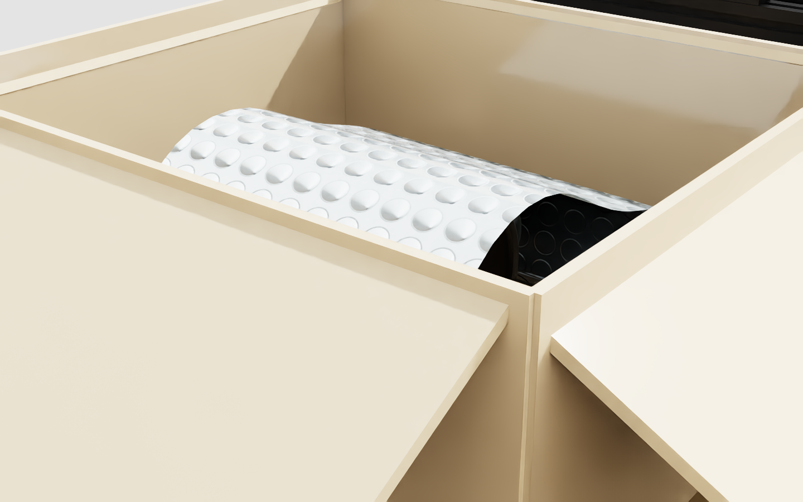
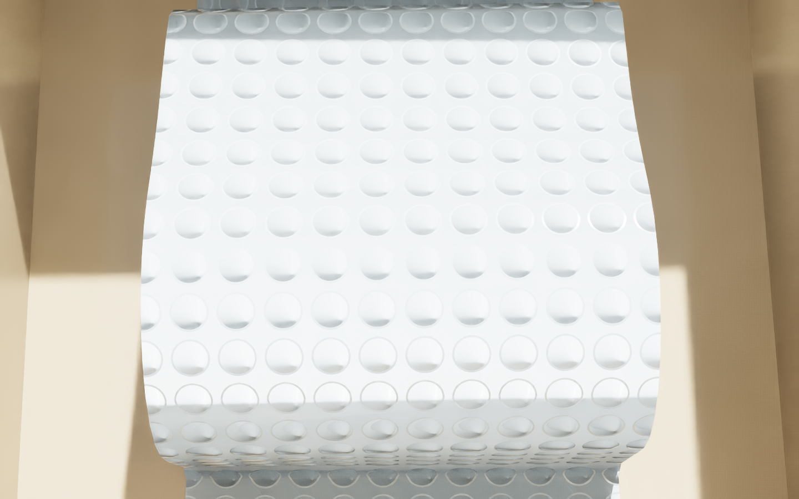
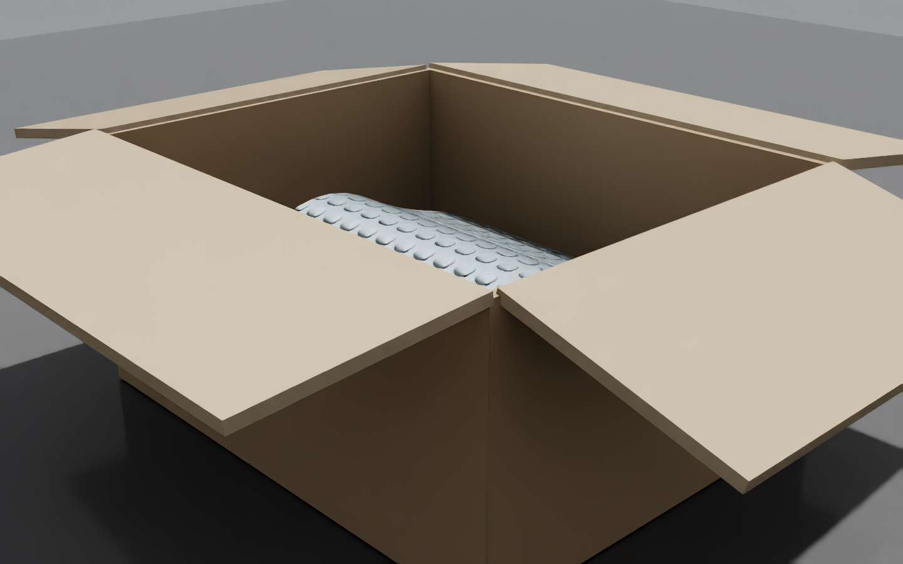

# wrapped_mug

逆物流情境的物件資產:**紙箱內用泡泡紙包覆的馬克杯**,可放進 stationary_ai 雙臂平台。

全程程序化生成。馬克杯用 NVIDIA 官方資產(`tools/fetch_assets.sh` 取得),
紙箱與包材的尺寸由馬克杯的實際 bbox 推導 —— 換杯子不用手改任何數字。

## 跑起來

```bash
tools/fetch_assets.sh                      # 一次就好

# 獨立場景(自建紙箱)
/isaac-sim/python.sh forge.py
/isaac-sim/python.sh verify_render.py

# 放進 stationary_ai 雙臂平台,用場景自己的紙箱
/isaac-sim/python.sh forge.py --rig /path/to/stationary_ai_carton_scene_flat.usd \
                              --out out/wrapped_mug_on_rig.usd
/isaac-sim/python.sh verify_render.py --usd out/wrapped_mug_on_rig.usd \
                                      --prefix /World --wide

# WebRTC 檢視 + 滑鼠拖曳
viewer/start_viewer.sh
```

## 成果

放進 stationary_ai 雙臂平台,用場景自帶的紙箱:


紙箱內部 —— 泡泡紙以「隧道」形式跨過馬克杯,兩側腳掌平貼箱底:



泡泡紋理是程序化生成的無縫法線貼圖,一格 UV = 一顆泡泡,泡距對齊真實規格 10 mm:



獨立場景版本(自建紙箱,尺寸由馬克杯推導):




## 做法

包材是 **surface deformable**。難處在於:折起來之後,膜的靜止形狀還是平的,
一放手就彈回去。PhysX 的 `restBendAngles`(顯式指定每條邊的靜止二面角)在這版沒實作,
所以改走另一條:

1. 用**曲率剖面積分**解析地折出包覆形狀 —— 沿弧長給定切線角再積分,
   保證等距映射,把平面裁片折成這個形狀不產生面內應變
2. 把這個形狀同時當作 `points` 和 `restShapePoints`,並設 `restBendAnglesDefault="restShapeDefault"`
3. 兩階段靜置:杯子 kinematic 讓膜先貼合 → 杯子轉動態一起落定
4. 把靜置結果寫回 `restShapePoints`、`velocities` 歸零

折痕成為零能量狀態,**不需要任何黏合,膜自己維持包覆**。

剖面是**隧道形**:兩側腳掌平貼箱底 → 垂直上升 → 頂部順著馬克杯的**投影凸包**跨過去
→ 下降 → 另一側腳掌。每一段都有支撐,所以不會倒、也不會被重力拉開。

用凸包而不是逐角度量最大半徑,有兩個理由:馬克杯是開口薄殼,網格含內壁,
逐角度取樣會抓到內表面讓剖面鋸齒(實測弧長被灌水 3.5 倍);而凸包同時也是
泡泡紙的實際行為 —— 膜會跨過把手與杯身之間的凹角,不會鑽進去。

馬克杯的碰撞體用解析形狀(圓柱 + 把手球鏈),不用網格 —— 原因見 `docs/FINDINGS.md` 第 4 條。

## 參數

全部在 `params.py`,每個值標註來源。膜的推導鏈只需要量一個數字:

```
W = 0.060 kg/m²     泡泡紙 60 GSM(文獻)
t = 0.004 m         等效殼厚 = 泡高(推導)
c = 0.034 m         彎曲長度,ASTM D1388 懸臂法  ← 唯一需要量測的,目前是假設值
D = W·g·c³                                      抗彎剛度
surfaceBendStiffness = D / t³                   官方:edge bend ∝ SBS · t³
omniphysics:mass = W × 面積                     顯式設質量,繞過 density×thickness 的歧義
```

## 檔案

| | |
| --- | --- |
| `params.py` | 所有參數與推導 |
| `wf_common.py` | 共用工具,每個函式對應一個實測踩到的坑 |
| `forge.py` | 生成 + 折疊靜置 + 烘焙 rest shape + 存檔 |
| `verify_render.py` | 重開產出的 USD、無外力播放、量漂移 + 四視角算圖 |
| `viewer/` | WebRTC 檢視器(含滑鼠拖曳的四道閘門處理) |
| `experiments/` | 定位問題用的最小實驗,每支都對應 FINDINGS 裡的一條 |
| `docs/FINDINGS.md` | **實測紀錄** —— 這份最值得先看 |

## 現況

放進 stationary_ai 平台(內部 197 × 177 × 87 mm 的紙箱)、無外力播放 360 步後:

| 指標 | 值 |
| --- | --- |
| 包材在箱外的頂點 | **0 / 510** |
| 包材展開尺寸 | 257.7 × 110.5 mm,面積 284.7 cm²,質量 1.71 g |
| 烘焙靜置漂移 | 7.6 mm(兩階段都在 240 步內收斂) |
| 紙箱 | bbox 與原始場景一致,完全沒被擾動 |
| 馬克杯 | 坐在箱底,bbox z 跨距 69.7 mm ≈ 杯徑 62.9 |

耳朵預設攤開(`CARTON["rig_flaps"] = "open_kinematic"`):場景自帶的 `crease_*` 鉸鏈
沒有 drive 也沒有 limit,自由鉸鏈在重力下一定塌回去蓋住開口。這裡不加 drive,
改成把每片用數值搜尋轉到最外翻的姿態再設成 kinematic,並停用對應的 crease 鉸鏈
(兩端都 kinematic 的 joint PhysX 會拒收)。手臂團隊要做「掀耳朵」序列時,
改成 `"free"` 並自行補 drive。

已知限制:

* `bending_length = 0.046 m` 是假設值,需要拿真泡泡紙做一次 ASTM D1388 懸臂測試
* 膜目前不透明(見 FINDINGS 第 10 條)
* 馬克杯用 `MUG["scale"] = 0.68` 縮過:官方那四顆直徑 89~93 mm,
  塞不進這個內高 87 mm 的紙箱,也留不出包材折過頂的空間
